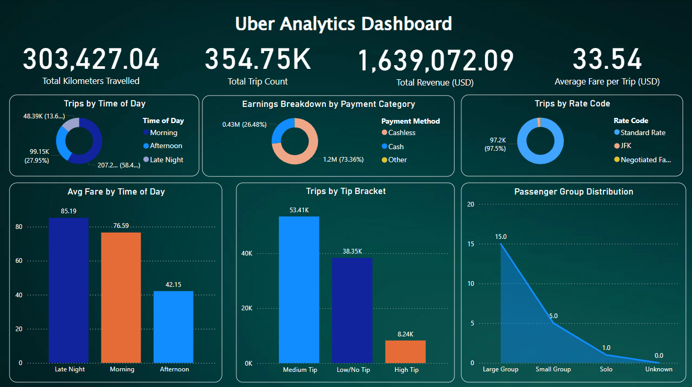

# 🚖 Uber Data Engineering & Analytics Project



## 📌 Project Overview

This project showcases an end-to-end modern data engineering pipeline built for Uber trip analytics. The pipeline extracts raw trip data, transforms it using `dbt`, models it into dimensional schemas in Snowflake, and visualizes key KPIs and trends using Power BI. Orchestration is handled via Apache Airflow.

---

## 🧱 Architecture


1. **Data Ingestion**  
   - Source: Raw CSVs or API  
   - Destination: Snowflake (Raw Staging)

2. **Transformation with dbt**  
   - Models: `dim_date`, `dim_trip_distance`, `dim_passenger_count`, `fact_trips`, and views like:
     - `vw_total_trip_count_card`
     - `vw_avg_fare_per_day_run`
     - `vw_high_tip_indicator`
     - `vw_trip_summary_by_hour`
   - Modeling: Star schema for optimized analytics

3. **Orchestration with Apache Airflow**  
   - Task sequencing, retries, and scheduling
   - Airflow DAG: executes dbt models daily

4. **Visualization**  
   - Tool: Power BI
   - Dashboards: KPIs, time-of-day analysis, tip patterns, passenger types

---

## 📊 Power BI Dashboard Highlights

- **Total Kilometers Travelled:** 303,427.04 km  
- **Total Trip Count:** 354,750 trips  
- **Total Revenue:** $1,639,072  
- **Avg Fare per Trip:** $33.54  
- **Trip Time Analysis:** Trips by Morning, Afternoon, Late Night  
- **Payment Breakdown:** Cashless, Cash, Other  
- **Passenger Groups:** Solo, Small Group, Large Group  
- **Tip Behavior:** Low/Medium/High Tip segmentation  
- **Rate Code Usage:** Standard Rate dominates

---
### Fact Table
- `fact_trips`: Contains transactional trip data

### Dimension Tables
- `dim_datetime`
- `dim_trip_distance`
- `dim_passenger_count`
- `dim_rate_code`
- `dim_payment_type`
- `dim_pickup_location`
- `dim_dropoff_location`

Each `VIEW` was designed to support a specific Power BI visualization:

| View Name                        | Purpose                                         |
|----------------------------------|-------------------------------------------------|
| `vw_daily_trips`                 | Daily trip count                               |
| `vw_avg_fare_per_day`           | Average fare trends over time                  |
| `vw_high_tip_indicator`         | Tip brackets (High, Medium, Low)               |
| `vw_trip_summary_by_hour`       | Time-of-day trip metrics                       |
| `vw_passenger_count_summary`    | Group size breakdown                           |
| `vw_payment_type_analysis`      | Payment method share and tip trends            |
| `vw_rate_code_share_case`       | Share of trips by rate code                    |
| `vw_trip_distance_bucketed`     | Short, Medium, Long trip categorization        |
| `vw_scatter_distance_fare`      | Scatter for fare vs. distance                  |
| `vw_total_trip_count_card`      | Total trips (card)                             |
| `vw_total_distance_card`        | Total kilometers traveled (card)               |
| `vw_total_revenue_card`         | Total revenue earned (card)                    |


## 🚀 How to Run

1. Clone the repo
2. Set up Snowflake connection and schema
3. Run dbt models:

```bash
dbt run

Contact
Made by Mujtaba Saqib
📧 mujtabasaqib654@gmail.com


